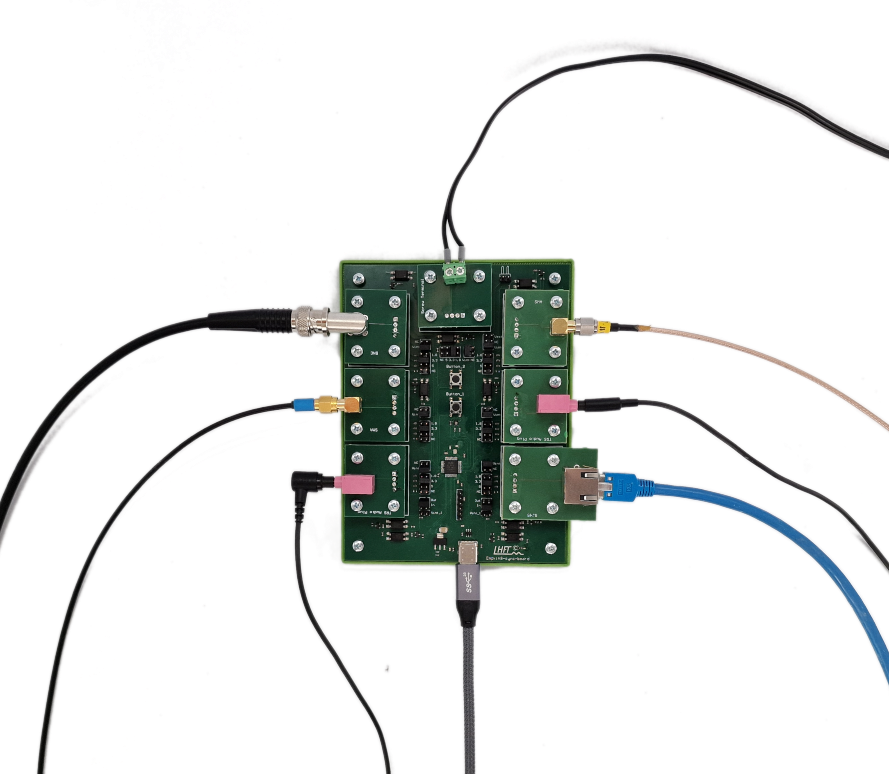

# Open Sync Board

Welcome to the Open Sync Board project, an open source framework for **hardware-based synchronization** of sensors in **multi-modal measurement scenarios**. The Open Sync Board (OSB) consists of a PCB which generates different synchronization signals for up to seven arbitrary outputs. THe PCB can be configured programmatically or using the corresponding graphical user interface. Here, we provide an overview of the repositories that belong to our project and are required to build your own OSB: 

- Schematic, PCB, 3D view and BOM of the OSB hardware: [https://365.altium.com/files/F87B11EB-A8F8-4EBC-8E65-F456D1F7A0D8](https://365.altium.com/files/F87B11EB-A8F8-4EBC-8E65-F456D1F7A0D8)
- Firmware code and flashing instructions: [https://github.com/empkins/open-sync-board-hardware](https://github.com/empkins/open-sync-board-hardware)
- Graphical User Interface for configuring and operating the PCB: [https://github.com/empkins/open-sync-board-gui](https://github.com/empkins/open-sync-board-gui)
- Python package to align recorded data based on the synchronization signal: [https://github.com/empkins/empkins-io/tree/main](https://github.com/empkins/empkins-io/tree/main)
- Examples on usage of the postprocessing module: [https://github.com/empkins/empkins-io/blob/main/examples/synchronization/Synchronization.ipynb](https://github.com/empkins/empkins-io/blob/main/examples/synchronization/Synchronization.ipynb)

